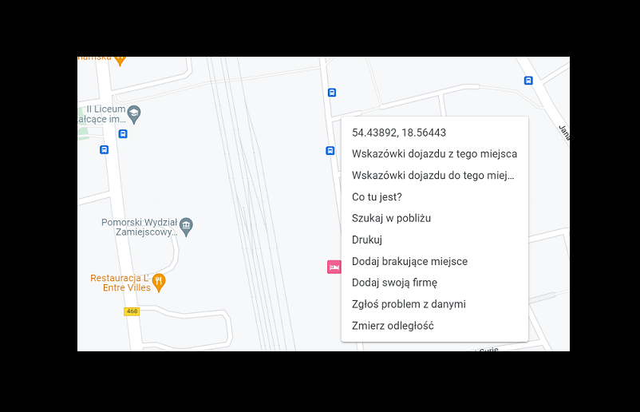

# Opis 
## **Wyświetlacz tablicy ZTM**
Program przetwarza zasoby API ZTM Gdańsk w formacie JSON w celu wyświetlenia tablicy przystankowej w obrębie transportu publicznego Trójmiasta i okolic.

# Funkcjonalności
* wyszukiwanie przez:
    * wprowadzenie nazwy przystanku
    * wybór ulubionego
    * wybór z mapy
* lista ulubionych
* wyświetlanie na mapie

# Instalacja
Python 3.10.3

Biblioteki:

pip install

`time` `webbrowser` `pyperclip` `redatetime` `sys` `sqlite3` `requests` `colorama` `os` `json` `logging` `threading`

# Obsługa programu
*uruchomienie*:
`ztm_main.py`

* w przypadku pierwszego uruchomienia należy wpisać `www` w przeciągu 10 sekund aby pobrać bazę przystanków
* wciśnięcie `enter` spowoduje przejście do opcji wyszukiwania
* w każdym momencie można wyjść z programu wybierając `x`

* wyszukiwanie przez:
    * wprowadzenie nazwy przystanku
    * wybór ulubionego
    * wybór z mapy

---
## Wyszukiwanie przez wprowadzenie nazwy przystanku

wybranie opcji wyszukiwania po nazwie `enter` podanie `”traug”` podaje listę z której wybieramy odpowiedni przystanek

po wprowadzeniu `<numeru>` i zatwierdzeniu `enter` mamy możliwość wyświetlenia przystanku na mapie wpisując `tak` bądź przejścia do wyświetlenia tablicy

Wyświetlacz pokazuje numer kierunek jazdy oraz czas przyjazdu w formacie, odliczanie do 30min powyżej 30 min godzina:minuta.

Dostępne są opcje odświeżania `enter` nowego wyszukiwania `nowe` ponownego wyboru z listy `nowe` wyświetlenie wybranego przystanku na mapie `mapa` oraz dodanie do ulubionych `u`.

---
## Wybór z mapy

Wyszukiwanie po współrzędnych przez skopiowanie z aplikacji `google.maps`

Rozwinięcie okna w dowolnym punkcie daje możliwość skopiowania pierwszego na liście zestawu współrzędnych.

Po zatwierdzeniu skopiowania otrzymujemy listę przystanków będących w zakresie ~300m od wskazanego punktu.

Jak w przypadku wyszukiwania po nazwie otrzymujemy wyświetlacz dla wybranego przystanku

---
## Wybór z ulubionych

Po dodaniu wyszukanych tablic możemy skorzystać z wyszukiwania z grupy ulubionych.
Edycja listy poprzez wpisanie numeru i zatwierdzenie. 
Samo zatwierdzenie `enter` da nam możliwość wpisania numeru do wyświetlenia.

*Print screen gif*

